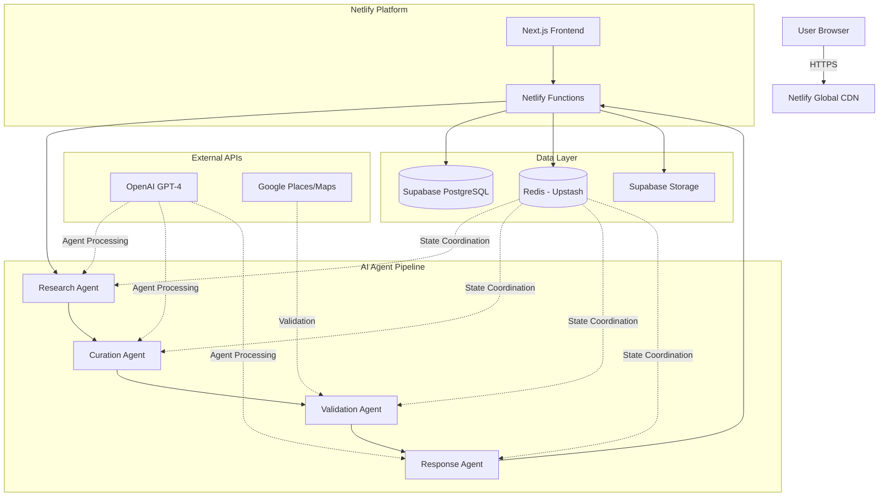
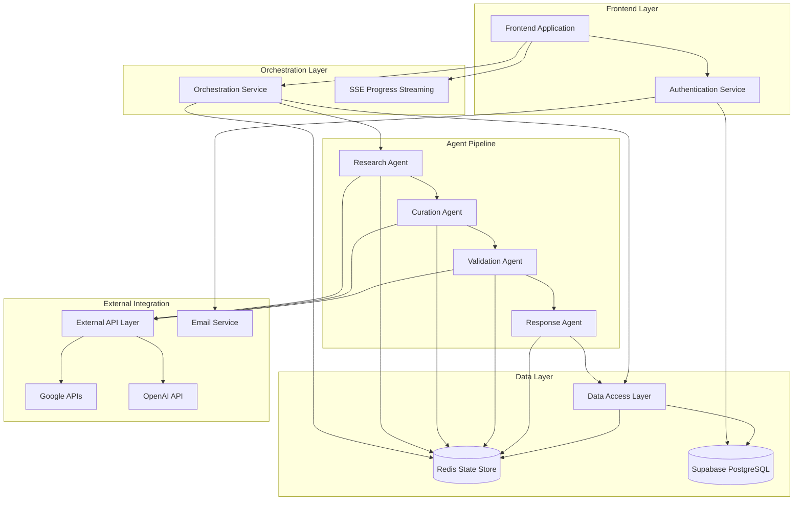
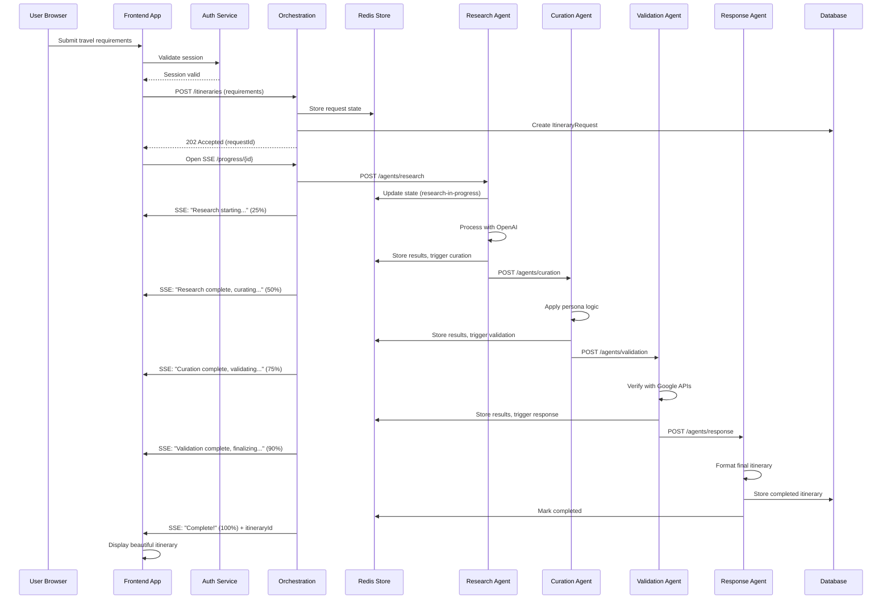
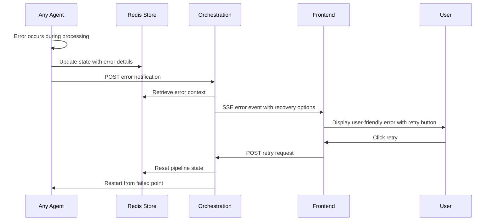

# Swift Travel Fullstack Architecture Document

## Introduction

This document outlines the complete fullstack architecture for Swift Travel, including backend systems, frontend implementation, and their integration. It serves as the single source of truth for AI-driven development, ensuring consistency across the entire technology stack.

This unified approach combines what would traditionally be separate backend and frontend architecture documents, streamlining the development process for modern fullstack applications where these concerns are increasingly intertwined.

### Starter Template or Existing Project

Based on the PRD analysis, Swift Travel is a **greenfield project** building on Cardinal's validated multi-agent AI orchestration patterns. The project leverages proven architectural concepts from Cardinal's experimentation phase rather than using a specific starter template.

**Key architectural decisions inherited from Cardinal:**
- Multi-agent orchestration approach (Research, Curation, Validation, Response agents)
- <20 second processing time requirement
- Node.js/TypeScript technology foundation
- Monorepo structure for rapid MVP iteration

Since this is not based on a specific starter template, we have full architectural flexibility while building on proven multi-agent coordination patterns.

### Change Log

| Date | Version | Description | Author |
|------|---------|-------------|---------|
| 2025-09-07 | 1.0 | Initial architecture document creation | Winston (Architect) |

## High Level Architecture

### Technical Summary

Swift Travel employs a **serverless-first multi-agent orchestration architecture** deployed on **Netlify + Supabase**, leveraging **Next.js 14** for the frontend and **Netlify Functions** for the backend. The system orchestrates four specialized AI agents (Research, Curation, Validation, Response) through a **sequential pipeline architecture** with **Redis-based state coordination** to generate personalized weekend itineraries within the <20 second processing constraint. **Real-time external API integration** with Google Places and Maps provides validation and enrichment, while **shared TypeScript interfaces** ensure type safety across the entire stack. This architecture achieves the PRD's goals of premium travel curation while maintaining cost efficiency and horizontal scalability.

### Platform and Infrastructure Choice

**Platform:** Netlify + Supabase  
**Key Services:** Netlify Functions, Supabase Database + Auth + Storage, Redis (Upstash), Google Places/Maps APIs  
**Deployment Host and Regions:** Netlify Global CDN (primary: US-East, EU-West)

**Rationale:** This platform combination maintains development velocity and cost efficiency while working within the GitHub + Netlify deployment constraint:

- **Netlify**: Serverless functions for AI processing, built-in GitHub integration, automatic deployments, global CDN for frontend
- **Supabase**: Managed PostgreSQL with real-time capabilities, built-in auth reduces complexity, automatic API generation
- **Redis (Upstash)**: Serverless Redis for agent state coordination and caching without infrastructure management
- **GitHub Integration**: Seamless CI/CD through Netlify's GitHub integration with branch previews and atomic deployments

**Key Constraint:** Netlify Functions have a **10-second timeout limit** (vs Vercel's 15 seconds), requiring more aggressive optimization for the <20 second total processing requirement.

### Repository Structure

**Structure:** Monorepo with npm workspaces  
**Monorepo Tool:** npm workspaces (native Node.js solution)  
**Package Organization:** Feature-based separation with shared utilities

**Rationale:** Monorepo structure optimizes for the <20 second processing requirement by eliminating inter-service latency while enabling shared TypeScript interfaces between frontend and backend. npm workspaces provides sufficient tooling without additional complexity layers, crucial for rapid MVP development.

### High Level Architecture Diagram



### Architectural Patterns

- **Multi-Agent Orchestration:** Function chaining pattern with Redis state coordination - _Rationale:_ Each agent as separate Netlify Function eliminates 10-second timeout risk while maintaining sequential processing benefits and enabling independent agent optimization
- **Serverless Functions:** Stateless functions with external state management - _Rationale:_ Leverages Netlify's 10-second function limit through optimized processing while providing automatic scaling
- **API Gateway Pattern:** Centralized request handling through Netlify Functions - _Rationale:_ Single entry point enables consistent auth, rate limiting, and monitoring with GitHub integration
- **Repository Pattern:** Abstract data access through Supabase client wrappers - _Rationale:_ Enables testing and future database flexibility while leveraging Supabase's auto-generated APIs
- **Shared Type System:** TypeScript interfaces in shared package - _Rationale:_ Ensures type safety across full stack and prevents frontend/backend data mismatches
- **Validation-First Integration:** External API validation before user presentation - _Rationale:_ Meets <5% inaccuracy requirement by catching hallucinations before user exposure

## Tech Stack

This is the DEFINITIVE technology selection for the entire Swift Travel project. All development must use these exact versions and approaches, optimized for GitHub + Netlify deployment with function chaining architecture.

### Technology Stack Table

| Category | Technology | Version | Purpose | Rationale |
|----------|------------|---------|---------|-----------|
| Frontend Language | TypeScript | ^5.3.0 | Type-safe frontend development | Prevents runtime errors, enables shared interfaces with backend |
| Frontend Framework | Next.js | ^14.0.0 | React-based frontend with SSR | App Router for modern routing, built-in optimization, Netlify compatibility |
| UI Component Library | Tailwind CSS + Headless UI | ^3.4.0 + ^1.7.0 | Utility-first styling with accessible components | Rapid development, consistent design system, mobile-first responsive |
| State Management | Zustand | ^4.4.0 | Lightweight client state management | Simple API, TypeScript-first, minimal boilerplate for agent progress tracking |
| Backend Language | TypeScript | ^5.3.0 | Type-safe backend development | Shared types with frontend, better debugging, consistent development experience |
| Backend Framework | Node.js + Express | ^20.0.0 + ^4.18.0 | Serverless function runtime | Netlify Functions compatibility, familiar patterns, middleware support |
| API Style | REST + Server-Sent Events | HTTP/1.1 + SSE | RESTful APIs with real-time progress | Function chaining requires progress updates, SSE for agent status streaming |
| Database | Supabase PostgreSQL | Latest | Primary data store with auth | Managed PostgreSQL, built-in auth, real-time subscriptions, automatic API generation |
| Cache | Redis (Upstash) | ^7.0 | Agent state coordination and caching | Serverless Redis for function chaining state, API response caching, session storage |
| File Storage | Supabase Storage | Latest | PDF exports and user uploads | S3-compatible storage integrated with auth, automatic CDN distribution |
| Authentication | Supabase Auth (Magic Links) | Latest | Passwordless user authentication | Frictionless auth experience, secure token management, built-in session handling |
| Frontend Testing | Vitest + React Testing Library | ^1.0.0 + ^13.4.0 | Unit and component testing | Fast test execution, Jest-compatible API, better TypeScript support |
| Backend Testing | Vitest + Supertest | ^1.0.0 + ^6.3.0 | API and integration testing | Consistent testing framework, function chaining workflow testing |
| E2E Testing | Playwright | ^1.40.0 | End-to-end user journey testing | Multi-agent pipeline validation, cross-browser testing, visual regression |
| Build Tool | Vite | ^5.0.0 | Fast development and production builds | Lightning-fast HMR, optimized bundling, TypeScript-first approach |
| Bundler | Rollup (via Vite) | ^4.0.0 | Production code bundling | Tree-shaking optimization, code splitting, Netlify deployment optimization |
| IaC Tool | Netlify Config | netlify.toml | Infrastructure as code for deployment | Git-based infrastructure management, preview deployments, environment configuration |
| CI/CD | GitHub Actions + Netlify | Latest | Automated testing and deployment | GitHub integration, branch previews, automated quality gates |
| Monitoring | Sentry + Netlify Analytics | ^7.0.0 + Built-in | Error tracking and performance monitoring | Agent pipeline error tracking, function performance monitoring, user analytics |
| Logging | Pino + Netlify Functions Logs | ^8.0.0 + Built-in | Structured logging across agents | JSON logging for agent coordination, built-in Netlify function logs |
| CSS Framework | Tailwind CSS | ^3.4.0 | Utility-first CSS framework | Mobile-first responsive design, design system consistency, small bundle size |

## Data Models

The core data models represent the business entities shared between frontend and backend, designed to support the multi-agent pipeline and complex itinerary relationships. These models enable type safety across the entire stack while accommodating the rich data structures generated by AI agents.

### User

**Purpose:** Represents authenticated users with their travel preferences and persona selections, enabling personalized recommendations and itinerary ownership.

**Key Attributes:**
- id: string (UUID) - Primary identifier from Supabase Auth
- email: string - User's email address for magic link authentication
- name: string | null - Optional display name for personalization
- preferences: UserPreferences - Stored travel preferences and persona history
- createdAt: Date - Account creation timestamp
- lastActiveAt: Date - Session tracking for engagement analytics

#### TypeScript Interface

```typescript
interface User {
  id: string;
  email: string;
  name: string | null;
  preferences: UserPreferences;
  createdAt: Date;
  lastActiveAt: Date;
}

interface UserPreferences {
  defaultPersona: PersonaType | null;
  budgetRange: BudgetRange;
  accessibilityNeeds: string[];
  dietaryRestrictions: string[];
  travelStyle: 'relaxed' | 'packed' | 'balanced';
  preferredActivities: ActivityType[];
}

type PersonaType = 'photography' | 'food-forward' | 'architecture' | 'family';
type BudgetRange = 'budget' | 'mid-range' | 'luxury' | 'no-limit';
```

#### Relationships
- One-to-many with Itinerary (user owns multiple itineraries)
- One-to-many with ItineraryRequest (tracks all generation attempts)

### Itinerary

**Purpose:** Represents a complete weekend travel plan generated by the multi-agent system, containing all activities, logistics, and metadata for a specific trip.

**Key Attributes:**
- id: string (UUID) - Primary identifier
- userId: string - Foreign key to User
- destination: Destination - Target location with geographic data
- persona: PersonaType - Applied persona lens for curation
- status: ItineraryStatus - Processing and completion state
- activities: Activity[] - Ordered list of recommended activities
- metadata: ItineraryMetadata - Processing details and quality metrics
- createdAt: Date - Generation timestamp
- updatedAt: Date - Last modification timestamp

#### TypeScript Interface

```typescript
interface Itinerary {
  id: string;
  userId: string;
  destination: Destination;
  persona: PersonaType;
  status: ItineraryStatus;
  activities: Activity[];
  metadata: ItineraryMetadata;
  createdAt: Date;
  updatedAt: Date;
}

interface Destination {
  name: string;
  city: string;
  region: string;
  country: string;
  coordinates: {
    lat: number;
    lng: number;
  };
  timeZone: string;
}

type ItineraryStatus = 'processing' | 'completed' | 'failed' | 'archived';

interface ItineraryMetadata {
  processingTimeSeconds: number;
  agentVersions: AgentVersions;
  qualityScore: number;
  validationResults: ValidationResults;
  costEstimate: CostEstimate;
}
```

#### Relationships
- Belongs-to User (foreign key: userId)
- One-to-many with Activity (embedded array)
- One-to-one with ItineraryRequest (generation context)

### Activity

**Purpose:** Individual recommendation within an itinerary, containing rich context from curation agents and validation results from external APIs.

**Key Attributes:**
- id: string (UUID) - Primary identifier
- itineraryId: string - Foreign key to parent Itinerary
- name: string - Activity title
- description: string - Rich narrative description from curation agent
- category: ActivityCategory - Classification for filtering and organization
- timing: ActivityTiming - Schedule and duration information
- location: ActivityLocation - Geographic and venue details
- validation: ValidationResult - External API verification status
- personaContext: PersonaContext - Persona-specific reasoning and highlights

#### TypeScript Interface

```typescript
interface Activity {
  id: string;
  itineraryId: string;
  name: string;
  description: string;
  category: ActivityCategory;
  timing: ActivityTiming;
  location: ActivityLocation;
  validation: ValidationResult;
  personaContext: PersonaContext;
}

type ActivityCategory = 
  | 'dining' 
  | 'sightseeing' 
  | 'culture' 
  | 'nature' 
  | 'shopping' 
  | 'nightlife' 
  | 'transport';

interface ActivityTiming {
  dayNumber: number; // 1-based day within itinerary
  startTime: string; // ISO time string
  duration: number; // minutes
  flexibility: 'fixed' | 'flexible' | 'weather-dependent';
  bufferTime: number; // minutes for transitions
}

interface ActivityLocation {
  name: string;
  address: string;
  coordinates: {
    lat: number;
    lng: number;
  };
  neighborhood: string;
  googlePlaceId: string | null;
  accessibility: AccessibilityInfo;
}
```

#### Relationships
- Belongs-to Itinerary (foreign key: itineraryId)
- References Google Places API data (via googlePlaceId)

### ItineraryRequest

**Purpose:** Captures the original user requirements and tracks the multi-agent processing pipeline for debugging, analytics, and improvement.

**Key Attributes:**
- id: string (UUID) - Primary identifier
- userId: string - Foreign key to User
- itineraryId: string | null - Foreign key to resulting Itinerary (null if failed)
- requirements: UserRequirements - Original user input and preferences
- processingLog: AgentProcessingLog[] - Detailed pipeline execution trace
- status: ProcessingStatus - Current state in the agent pipeline
- errorDetails: ProcessingError | null - Failure information if applicable

#### TypeScript Interface

```typescript
interface ItineraryRequest {
  id: string;
  userId: string;
  itineraryId: string | null;
  requirements: UserRequirements;
  processingLog: AgentProcessingLog[];
  status: ProcessingStatus;
  errorDetails: ProcessingError | null;
  createdAt: Date;
  updatedAt: Date;
}

interface UserRequirements {
  destination: string;
  persona: PersonaType;
  dates: {
    startDate: Date;
    endDate: Date;
  };
  budgetRange: BudgetRange;
  groupSize: number;
  specialRequests: string[];
  accessibilityNeeds: string[];
}

type ProcessingStatus = 
  | 'initiated' 
  | 'research-in-progress' 
  | 'research-completed'
  | 'curation-in-progress'
  | 'curation-completed'
  | 'validation-in-progress'
  | 'validation-completed'
  | 'response-in-progress'
  | 'completed'
  | 'failed';
```

#### Relationships
- Belongs-to User (foreign key: userId)
- One-to-one with Itinerary (foreign key: itineraryId, nullable)

## API Specification

Based on the REST + Server-Sent Events API style from the Tech Stack, this specification defines all endpoints supporting the function chaining multi-agent architecture with real-time progress updates.

### REST API Specification

```yaml
openapi: 3.0.0
info:
  title: Swift Travel API
  version: 1.0.0
  description: REST API for Swift Travel multi-agent itinerary generation platform
servers:
  - url: https://swift-travel.netlify.app/.netlify/functions
    description: Netlify Functions production endpoint
  - url: http://localhost:8888/.netlify/functions  
    description: Local development endpoint

paths:
  /auth/magic-link:
    post:
      summary: Send magic link for authentication
      requestBody:
        required: true
        content:
          application/json:
            schema:
              type: object
              properties:
                email:
                  type: string
                  format: email
              required:
                - email
      responses:
        '200':
          description: Magic link sent successfully
        '429':
          description: Rate limit exceeded

  /auth/verify:
    post:
      summary: Verify magic link token
      requestBody:
        required: true
        content:
          application/json:
            schema:
              type: object
              properties:
                token:
                  type: string
              required:
                - token
      responses:
        '200':
          description: Authentication successful
          content:
            application/json:
              schema:
                type: object
                properties:
                  user:
                    $ref: '#/components/schemas/User'
                  sessionToken:
                    type: string

  /itineraries:
    post:
      summary: Initiate itinerary generation
      security:
        - bearerAuth: []
      requestBody:
        required: true
        content:
          application/json:
            schema:
              $ref: '#/components/schemas/ItineraryRequest'
      responses:
        '202':
          description: Itinerary generation initiated
          content:
            application/json:
              schema:
                type: object
                properties:
                  requestId:
                    type: string
                    format: uuid
                  status:
                    type: string
                    enum: [initiated]
                  estimatedTime:
                    type: number
                    description: Estimated completion time in seconds
    get:
      summary: List user's itineraries
      security:
        - bearerAuth: []
      parameters:
        - name: status
          in: query
          schema:
            type: string
            enum: [processing, completed, failed, archived]
        - name: limit
          in: query
          schema:
            type: integer
            default: 20
        - name: offset
          in: query
          schema:
            type: integer
            default: 0
      responses:
        '200':
          description: Itineraries retrieved successfully
          content:
            application/json:
              schema:
                type: object
                properties:
                  itineraries:
                    type: array
                    items:
                      $ref: '#/components/schemas/Itinerary'
                  total:
                    type: integer

  /itineraries/{id}:
    get:
      summary: Get specific itinerary
      security:
        - bearerAuth: []
      parameters:
        - name: id
          in: path
          required: true
          schema:
            type: string
            format: uuid
      responses:
        '200':
          description: Itinerary retrieved successfully
          content:
            application/json:
              schema:
                $ref: '#/components/schemas/Itinerary'
        '404':
          description: Itinerary not found

  /itineraries/{id}/progress:
    get:
      summary: Server-sent events for processing progress
      parameters:
        - name: id
          in: path
          required: true
          schema:
            type: string
            format: uuid
      responses:
        '200':
          description: SSE stream for real-time progress updates
          content:
            text/event-stream:
              schema:
                type: string
              examples:
                research_started:
                  value: |
                    event: progress
                    data: {"stage": "research-in-progress", "message": "Discovering unique experiences in Paris...", "progress": 25}
                
                research_completed:
                  value: |
                    event: progress  
                    data: {"stage": "research-completed", "message": "Research complete. Starting curation...", "progress": 50}
                
                completed:
                  value: |
                    event: completed
                    data: {"itineraryId": "uuid", "message": "Your personalized itinerary is ready!", "progress": 100}

  /itineraries/{id}/export/pdf:
    get:
      summary: Export itinerary as PDF
      security:
        - bearerAuth: []
      parameters:
        - name: id
          in: path
          required: true
          schema:
            type: string
            format: uuid
      responses:
        '200':
          description: PDF export successful
          content:
            application/pdf:
              schema:
                type: string
                format: binary

  /itineraries/{id}/share:
    post:
      summary: Create shareable link
      security:
        - bearerAuth: []
      parameters:
        - name: id
          in: path
          required: true
          schema:
            type: string
            format: uuid
      requestBody:
        required: true
        content:
          application/json:
            schema:
              type: object
              properties:
                expiresAt:
                  type: string
                  format: date-time
                  nullable: true
                permissions:
                  type: string
                  enum: [read-only, comment]
      responses:
        '200':
          description: Shareable link created
          content:
            application/json:
              schema:
                type: object
                properties:
                  shareUrl:
                    type: string
                    format: uri
                  expiresAt:
                    type: string
                    format: date-time
                    nullable: true

  /shared/{token}:
    get:
      summary: Access shared itinerary
      parameters:
        - name: token
          in: path
          required: true
          schema:
            type: string
      responses:
        '200':
          description: Shared itinerary accessed
          content:
            application/json:
              schema:
                $ref: '#/components/schemas/Itinerary'
        '404':
          description: Share link not found or expired

  /agents/research:
    post:
      summary: Research agent function (internal)
      security:
        - internalAuth: []
      requestBody:
        required: true
        content:
          application/json:
            schema:
              type: object
              properties:
                requestId:
                  type: string
                  format: uuid
                requirements:
                  $ref: '#/components/schemas/UserRequirements'
      responses:
        '200':
          description: Research completed, triggers curation

  /agents/curation:
    post:
      summary: Curation agent function (internal)
      security:
        - internalAuth: []
      requestBody:
        required: true
        content:
          application/json:
            schema:
              type: object
              properties:
                requestId:
                  type: string
                  format: uuid
                researchResults:
                  type: object
      responses:
        '200':
          description: Curation completed, triggers validation

  /agents/validation:
    post:
      summary: Validation agent function (internal)
      security:
        - internalAuth: []
      requestBody:
        required: true
        content:
          application/json:
            schema:
              type: object
              properties:
                requestId:
                  type: string
                  format: uuid
                curationResults:
                  type: object
      responses:
        '200':
          description: Validation completed, triggers response

  /agents/response:
    post:
      summary: Response agent function (internal)
      security:
        - internalAuth: []
      requestBody:
        required: true
        content:
          application/json:
            schema:
              type: object
              properties:
                requestId:
                  type: string
                  format: uuid
                validationResults:
                  type: object
      responses:
        '200':
          description: Response completed, itinerary ready

components:
  securitySchemes:
    bearerAuth:
      type: http
      scheme: bearer
      bearerFormat: JWT
    internalAuth:
      type: apiKey
      in: header
      name: X-Internal-Token

  schemas:
    User:
      type: object
      properties:
        id:
          type: string
          format: uuid
        email:
          type: string
          format: email
        name:
          type: string
          nullable: true
        preferences:
          $ref: '#/components/schemas/UserPreferences'
        createdAt:
          type: string
          format: date-time
        lastActiveAt:
          type: string
          format: date-time

    UserPreferences:
      type: object
      properties:
        defaultPersona:
          type: string
          enum: [photography, food-forward, architecture, family]
          nullable: true
        budgetRange:
          type: string
          enum: [budget, mid-range, luxury, no-limit]
        accessibilityNeeds:
          type: array
          items:
            type: string
        dietaryRestrictions:
          type: array
          items:
            type: string
        travelStyle:
          type: string
          enum: [relaxed, packed, balanced]

    Itinerary:
      type: object
      properties:
        id:
          type: string
          format: uuid
        userId:
          type: string
          format: uuid
        destination:
          $ref: '#/components/schemas/Destination'
        persona:
          type: string
          enum: [photography, food-forward, architecture, family]
        status:
          type: string
          enum: [processing, completed, failed, archived]
        activities:
          type: array
          items:
            $ref: '#/components/schemas/Activity'
        metadata:
          $ref: '#/components/schemas/ItineraryMetadata'
        createdAt:
          type: string
          format: date-time
        updatedAt:
          type: string
          format: date-time

    Destination:
      type: object
      properties:
        name:
          type: string
        city:
          type: string
        region:
          type: string
        country:
          type: string
        coordinates:
          type: object
          properties:
            lat:
              type: number
            lng:
              type: number
        timeZone:
          type: string

    Activity:
      type: object
      properties:
        id:
          type: string
          format: uuid
        itineraryId:
          type: string
          format: uuid
        name:
          type: string
        description:
          type: string
        category:
          type: string
          enum: [dining, sightseeing, culture, nature, shopping, nightlife, transport]
        timing:
          $ref: '#/components/schemas/ActivityTiming'
        location:
          $ref: '#/components/schemas/ActivityLocation'

    ActivityTiming:
      type: object
      properties:
        dayNumber:
          type: integer
          minimum: 1
        startTime:
          type: string
          format: time
        duration:
          type: integer
          minimum: 0
        flexibility:
          type: string
          enum: [fixed, flexible, weather-dependent]
        bufferTime:
          type: integer
          minimum: 0

    ActivityLocation:
      type: object
      properties:
        name:
          type: string
        address:
          type: string
        coordinates:
          type: object
          properties:
            lat:
              type: number
            lng:
              type: number
        neighborhood:
          type: string
        googlePlaceId:
          type: string
          nullable: true

    ItineraryMetadata:
      type: object
      properties:
        processingTimeSeconds:
          type: number
        qualityScore:
          type: number
          minimum: 0
          maximum: 10
        costEstimate:
          type: object
          properties:
            currency:
              type: string
            total:
              type: number
            breakdown:
              type: object

    UserRequirements:
      type: object
      properties:
        destination:
          type: string
        persona:
          type: string
          enum: [photography, food-forward, architecture, family]
        dates:
          type: object
          properties:
            startDate:
              type: string
              format: date
            endDate:
              type: string
              format: date
        budgetRange:
          type: string
          enum: [budget, mid-range, luxury, no-limit]
        groupSize:
          type: integer
          minimum: 1
        specialRequests:
          type: array
          items:
            type: string
        accessibilityNeeds:
          type: array
          items:
            type: string
```

## Components

Based on the architectural patterns, tech stack, and data models defined above, the system is organized into logical components that separate concerns while enabling efficient communication. Each component has clear boundaries and interfaces optimized for the function chaining architecture.

### Frontend Application

**Responsibility:** User interface for itinerary generation, progress tracking, and result consumption with mobile-first responsive design

**Key Interfaces:**
- React components for persona selection and requirements input
- Real-time progress tracking via Server-Sent Events
- Itinerary display with interactive timeline and activity cards
- PDF export and social sharing functionality

**Dependencies:** Supabase Auth, REST API endpoints, SSE progress streams

**Technology Stack:** Next.js 14 (App Router), TypeScript, Tailwind CSS, Zustand state management, deployed via Netlify static hosting

### Authentication Service

**Responsibility:** Magic link authentication, JWT token management, and user session coordination with Supabase Auth integration

**Key Interfaces:**
- Magic link generation and email delivery
- Token validation and JWT creation
- Session management and renewal
- User preference storage and retrieval

**Dependencies:** Supabase Auth, email delivery service, Redis session storage

**Technology Stack:** Netlify Functions, Supabase Auth SDK, JWT libraries, email delivery integration

### Orchestration Service

**Responsibility:** Coordinates the multi-agent pipeline, manages processing state in Redis, and provides real-time progress updates via Server-Sent Events

**Key Interfaces:**
- Itinerary request intake and validation
- Agent chaining coordination (Research → Curation → Validation → Response)
- Real-time progress broadcasting via SSE
- Error handling and recovery across agent failures

**Dependencies:** Redis state store, all agent services, SSE connection management

**Technology Stack:** Netlify Functions, Redis (Upstash), Server-Sent Events, agent coordination logic

### Research Agent

**Responsibility:** Discovers unique destinations and activities based on user requirements and persona selection, leveraging web research and local knowledge APIs

**Key Interfaces:**
- User requirements processing and destination research
- Persona-specific activity discovery (photography spots, food scenes, architecture, family activities)
- Data enrichment with local context and cultural insights
- Research results formatting for curation agent consumption

**Dependencies:** OpenAI GPT-4 API, web search APIs, local knowledge databases

**Technology Stack:** Netlify Functions, OpenAI SDK, external research APIs, structured data processing

### Curation Agent

**Responsibility:** Creates personalized itineraries from research results, applying persona-specific curation logic and narrative storytelling for premium experience

**Key Interfaces:**
- Research result processing and activity selection
- Persona-driven curation (Photography Weekend, Food-Forward Explorer, Architecture Enthusiast, Family Adventure)
- Narrative generation with "why this matters" storytelling
- Timing optimization and neighborhood clustering

**Dependencies:** Research Agent output, OpenAI GPT-4 API, persona-specific prompts and logic

**Technology Stack:** Netlify Functions, OpenAI SDK, persona curation algorithms, timing optimization logic

### Validation Agent

**Responsibility:** Verifies all recommendations against external APIs to ensure accuracy, prevents hallucinations, and enriches activity data with real-world information

**Key Interfaces:**
- Activity verification against Google Places API
- Business hours, contact info, and rating validation
- Accessibility information and current status checking
- Quality scoring and confidence assessment

**Dependencies:** Google Places API, Google Maps API, Curation Agent output

**Technology Stack:** Netlify Functions, Google Places/Maps SDKs, validation scoring algorithms, data enrichment logic

### Response Agent

**Responsibility:** Formats validated itinerary data into beautiful, user-friendly presentations optimized for mobile consumption and sharing

**Key Interfaces:**
- Final itinerary formatting and presentation optimization
- Mobile-responsive layout generation
- Export preparation (PDF-ready formatting)
- Shareable content creation with social media optimization

**Dependencies:** Validation Agent output, formatting templates, export generation utilities

**Technology Stack:** Netlify Functions, PDF generation libraries, template processing, mobile-optimized formatting

### Data Access Layer

**Responsibility:** Abstracts database operations through Supabase client wrappers, enabling testing and future database flexibility while leveraging auto-generated APIs

**Key Interfaces:**
- User CRUD operations with preference management
- Itinerary storage with complex activity relationships
- Processing request tracking and audit trails
- Caching layer integration with Redis

**Dependencies:** Supabase PostgreSQL, Redis cache, database connection management

**Technology Stack:** Supabase JavaScript SDK, Redis client, TypeScript data access patterns, connection pooling

### External API Integration Layer

**Responsibility:** Manages all external API communications with proper rate limiting, caching, error handling, and cost optimization strategies

**Key Interfaces:**
- Google Places/Maps API integration with rate limiting
- OpenAI API calls with cost tracking and optimization
- Email delivery service integration
- External research API coordination

**Dependencies:** Google APIs, OpenAI API, email services, rate limiting infrastructure

**Technology Stack:** API client libraries, rate limiting utilities, caching strategies, error recovery mechanisms

### Component Diagrams



## Core Workflows

The following sequence diagrams illustrate key system workflows that demonstrate the function chaining architecture and component interactions:



## Database Schema

Based on the PostgreSQL database selection and data models defined above, here's the concrete schema implementation:

```sql
-- Extensions
CREATE EXTENSION IF NOT EXISTS "uuid-ossp";
CREATE EXTENSION IF NOT EXISTS "postgis";

-- Users table (extends Supabase auth.users)
CREATE TABLE public.users (
    id UUID PRIMARY KEY DEFAULT uuid_generate_v4(),
    email TEXT NOT NULL UNIQUE,
    name TEXT,
    preferences JSONB DEFAULT '{}',
    created_at TIMESTAMPTZ DEFAULT NOW(),
    last_active_at TIMESTAMPTZ DEFAULT NOW()
);

-- Enable RLS
ALTER TABLE public.users ENABLE ROW LEVEL SECURITY;

-- Itineraries table
CREATE TABLE public.itineraries (
    id UUID PRIMARY KEY DEFAULT uuid_generate_v4(),
    user_id UUID NOT NULL REFERENCES public.users(id) ON DELETE CASCADE,
    destination JSONB NOT NULL,
    persona TEXT NOT NULL CHECK (persona IN ('photography', 'food-forward', 'architecture', 'family')),
    status TEXT NOT NULL DEFAULT 'processing' CHECK (status IN ('processing', 'completed', 'failed', 'archived')),
    activities JSONB[] DEFAULT '{}',
    metadata JSONB DEFAULT '{}',
    created_at TIMESTAMPTZ DEFAULT NOW(),
    updated_at TIMESTAMPTZ DEFAULT NOW()
);

-- Activities table (normalized for better querying)
CREATE TABLE public.activities (
    id UUID PRIMARY KEY DEFAULT uuid_generate_v4(),
    itinerary_id UUID NOT NULL REFERENCES public.itineraries(id) ON DELETE CASCADE,
    name TEXT NOT NULL,
    description TEXT NOT NULL,
    category TEXT NOT NULL CHECK (category IN ('dining', 'sightseeing', 'culture', 'nature', 'shopping', 'nightlife', 'transport')),
    timing JSONB NOT NULL,
    location JSONB NOT NULL,
    validation JSONB DEFAULT '{}',
    persona_context JSONB DEFAULT '{}',
    created_at TIMESTAMPTZ DEFAULT NOW()
);

-- Itinerary requests table (for tracking and analytics)
CREATE TABLE public.itinerary_requests (
    id UUID PRIMARY KEY DEFAULT uuid_generate_v4(),
    user_id UUID NOT NULL REFERENCES public.users(id) ON DELETE CASCADE,
    itinerary_id UUID REFERENCES public.itineraries(id) ON DELETE SET NULL,
    requirements JSONB NOT NULL,
    processing_log JSONB[] DEFAULT '{}',
    status TEXT NOT NULL DEFAULT 'initiated',
    error_details JSONB,
    created_at TIMESTAMPTZ DEFAULT NOW(),
    updated_at TIMESTAMPTZ DEFAULT NOW()
);

-- Share tokens table
CREATE TABLE public.share_tokens (
    id UUID PRIMARY KEY DEFAULT uuid_generate_v4(),
    itinerary_id UUID NOT NULL REFERENCES public.itineraries(id) ON DELETE CASCADE,
    token TEXT NOT NULL UNIQUE,
    permissions TEXT NOT NULL DEFAULT 'read-only' CHECK (permissions IN ('read-only', 'comment')),
    expires_at TIMESTAMPTZ,
    created_at TIMESTAMPTZ DEFAULT NOW()
);

-- Indexes for performance
CREATE INDEX idx_itineraries_user_id ON public.itineraries(user_id);
CREATE INDEX idx_itineraries_status ON public.itineraries(status);
CREATE INDEX idx_itineraries_created_at ON public.itineraries(created_at DESC);
CREATE INDEX idx_activities_itinerary_id ON public.activities(itinerary_id);
CREATE INDEX idx_activities_category ON public.activities(category);
CREATE INDEX idx_requests_user_id ON public.itinerary_requests(user_id);
CREATE INDEX idx_requests_status ON public.itinerary_requests(status);
CREATE INDEX idx_share_tokens_token ON public.share_tokens(token);
CREATE INDEX idx_share_tokens_expires ON public.share_tokens(expires_at);

-- RLS Policies
CREATE POLICY "Users can view own data" ON public.users FOR SELECT USING (auth.uid() = id);
CREATE POLICY "Users can update own data" ON public.users FOR UPDATE USING (auth.uid() = id);

CREATE POLICY "Users can view own itineraries" ON public.itineraries FOR SELECT USING (auth.uid() = user_id);
CREATE POLICY "Users can create itineraries" ON public.itineraries FOR INSERT WITH CHECK (auth.uid() = user_id);
CREATE POLICY "Users can update own itineraries" ON public.itineraries FOR UPDATE USING (auth.uid() = user_id);

-- Functions for updated_at
CREATE OR REPLACE FUNCTION update_updated_at_column()
RETURNS TRIGGER AS $$
BEGIN
    NEW.updated_at = NOW();
    RETURN NEW;
END;
$$ language 'plpgsql';

CREATE TRIGGER update_itineraries_updated_at BEFORE UPDATE ON public.itineraries
    FOR EACH ROW EXECUTE FUNCTION update_updated_at_column();

CREATE TRIGGER update_requests_updated_at BEFORE UPDATE ON public.itinerary_requests
    FOR EACH ROW EXECUTE FUNCTION update_updated_at_column();
```

## Unified Project Structure

Monorepo structure optimized for GitHub + Netlify deployment with function chaining architecture:

```
swift-travel/
├── .github/                    # GitHub workflows and templates
│   └── workflows/
│       ├── ci.yml             # Test, lint, type-check pipeline
│       └── deploy.yml         # Netlify deployment workflow
├── .netlify/                  # Netlify configuration
│   └── functions/             # Netlify Functions (auto-deployed)
├── apps/                      # Application packages
│   ├── web/                   # Frontend Next.js application
│   │   ├── src/
│   │   │   ├── app/           # Next.js 14 App Router
│   │   │   │   ├── (auth)/    # Auth route groups
│   │   │   │   ├── dashboard/ # User dashboard
│   │   │   │   └── itinerary/ # Itinerary views
│   │   │   ├── components/    # React components
│   │   │   │   ├── ui/        # Reusable UI components
│   │   │   │   ├── forms/     # Form components
│   │   │   │   └── itinerary/ # Itinerary-specific components
│   │   │   ├── hooks/         # Custom React hooks
│   │   │   ├── lib/           # Utility libraries
│   │   │   ├── stores/        # Zustand stores
│   │   │   └── styles/        # Global styles and themes
│   │   ├── public/            # Static assets
│   │   ├── tailwind.config.js # Tailwind configuration
│   │   ├── next.config.js     # Next.js configuration
│   │   └── package.json
│   └── functions/             # Netlify Functions source
│       ├── auth/              # Authentication functions
│       ├── agents/            # AI agent functions
│       ├── itineraries/       # Itinerary CRUD functions
│       └── shared/            # Shared function utilities
├── packages/                  # Shared packages
│   ├── shared/                # Shared types and utilities
│   │   ├── src/
│   │   │   ├── types/         # TypeScript interfaces
│   │   │   ├── constants/     # Shared constants
│   │   │   ├── utils/         # Shared utilities
│   │   │   └── validation/    # Schema validation
│   │   └── package.json
│   ├── database/              # Database utilities and migrations
│   │   ├── src/
│   │   │   ├── migrations/    # SQL migration files
│   │   │   ├── schemas/       # Database schemas
│   │   │   └── client.ts      # Database client setup
│   │   └── package.json
│   └── agents/                # Agent coordination utilities
│       ├── src/
│       │   ├── research/      # Research agent logic
│       │   ├── curation/      # Curation agent logic
│       │   ├── validation/    # Validation agent logic
│       │   ├── response/      # Response agent logic
│       │   └── orchestration/ # Pipeline coordination
│       └── package.json
├── docs/                      # Documentation
│   ├── prd.md                 # Product Requirements Document
│   ├── architecture.md        # This document
│   └── api/                   # API documentation
├── scripts/                   # Build and utility scripts
│   ├── dev.sh                 # Local development setup
│   ├── build.sh               # Production build
│   └── deploy.sh              # Deployment utilities
├── .env.example               # Environment variables template
├── .gitignore                 # Git ignore patterns
├── netlify.toml               # Netlify configuration
├── package.json               # Root package.json with workspaces
├── turbo.json                 # Turborepo configuration (if using)
└── README.md                  # Project overview and setup
```

## Development Workflow

### Local Development Setup

```bash
# Prerequisites
node --version  # v20+
npm --version   # v9+
git --version   # v2.30+

# Clone and setup
git clone https://github.com/[username]/swift-travel.git
cd swift-travel
npm install
```

### Initial Setup

```bash
# Environment setup
cp .env.example .env.local
# Edit .env.local with your API keys and database URLs

# Database setup
npm run db:migrate
npm run db:seed

# Install Netlify CLI for local functions
npm install -g netlify-cli
netlify login
```

### Development Commands

```bash
# Start all services (frontend + functions)
npm run dev

# Start frontend only
npm run dev:web

# Start functions only  
npm run dev:functions

# Run tests
npm run test           # All tests
npm run test:unit      # Unit tests
npm run test:e2e       # E2E tests
npm run test:functions # Function tests

# Build and deploy
npm run build          # Production build
npm run deploy:preview # Deploy preview
npm run deploy:prod    # Deploy production
```

### Environment Configuration

```bash
# Frontend (.env.local)
NEXT_PUBLIC_SUPABASE_URL=your_supabase_url
NEXT_PUBLIC_SUPABASE_ANON_KEY=your_supabase_anon_key
NEXT_PUBLIC_API_BASE_URL=http://localhost:8888/.netlify/functions

# Functions (.env)
SUPABASE_SERVICE_ROLE_KEY=your_service_role_key
OPENAI_API_KEY=your_openai_key
GOOGLE_PLACES_API_KEY=your_google_places_key
GOOGLE_MAPS_API_KEY=your_google_maps_key
UPSTASH_REDIS_URL=your_redis_url
UPSTASH_REDIS_TOKEN=your_redis_token
INTERNAL_API_KEY=your_internal_agent_key

# Shared
DATABASE_URL=your_supabase_db_url
JWT_SECRET=your_jwt_secret
ENVIRONMENT=development
```

## Deployment Architecture

### Deployment Strategy

**Frontend Deployment:**
- **Platform:** Netlify Static Hosting with global CDN
- **Build Command:** `npm run build:web`
- **Output Directory:** `apps/web/out` (Next.js static export)
- **CDN/Edge:** Netlify Edge Network with automatic optimization

**Backend Deployment:**
- **Platform:** Netlify Functions (serverless)
- **Build Command:** `npm run build:functions`
- **Deployment Method:** Automatic deployment from `apps/functions/` directory

### CI/CD Pipeline

```yaml
# .github/workflows/ci.yml
name: CI/CD Pipeline
on:
  push:
    branches: [main, develop]
  pull_request:
    branches: [main]

jobs:
  test:
    runs-on: ubuntu-latest
    steps:
      - uses: actions/checkout@v4
      - uses: actions/setup-node@v4
        with:
          node-version: '20'
          cache: 'npm'
      
      - run: npm ci
      - run: npm run lint
      - run: npm run type-check
      - run: npm run test:unit
      - run: npm run test:functions
      
      - name: E2E Tests
        run: npm run test:e2e
        env:
          SUPABASE_URL: ${{ secrets.SUPABASE_URL }}
          SUPABASE_ANON_KEY: ${{ secrets.SUPABASE_ANON_KEY }}

  deploy-preview:
    needs: test
    if: github.event_name == 'pull_request'
    runs-on: ubuntu-latest
    steps:
      - uses: actions/checkout@v4
      - run: npm ci && npm run build
      - uses: netlify/actions/cli@master
        with:
          args: deploy --dir=apps/web/out
        env:
          NETLIFY_AUTH_TOKEN: ${{ secrets.NETLIFY_AUTH_TOKEN }}
          NETLIFY_SITE_ID: ${{ secrets.NETLIFY_SITE_ID }}

  deploy-production:
    needs: test
    if: github.ref == 'refs/heads/main'
    runs-on: ubuntu-latest
    steps:
      - uses: actions/checkout@v4
      - run: npm ci && npm run build
      - uses: netlify/actions/cli@master
        with:
          args: deploy --prod --dir=apps/web/out
        env:
          NETLIFY_AUTH_TOKEN: ${{ secrets.NETLIFY_AUTH_TOKEN }}
          NETLIFY_SITE_ID: ${{ secrets.NETLIFY_SITE_ID }}
```

### Environments

| Environment | Frontend URL | Backend URL | Purpose |
|-------------|--------------|-------------|---------|
| Development | http://localhost:3000 | http://localhost:8888/.netlify/functions | Local development |
| Staging | https://develop--swift-travel.netlify.app | https://develop--swift-travel.netlify.app/.netlify/functions | Pre-production testing |
| Production | https://swift-travel.com | https://swift-travel.com/.netlify/functions | Live environment |

## Security and Performance

### Security Requirements

**Frontend Security:**
- CSP Headers: `default-src 'self'; script-src 'self' 'unsafe-inline'; connect-src 'self' https://api.openai.com https://*.supabase.co`
- XSS Prevention: Content sanitization for all user inputs, Next.js built-in protections
- Secure Storage: HTTP-only cookies for session tokens, localStorage for non-sensitive preferences

**Backend Security:**
- Input Validation: Zod schema validation for all API inputs and agent data
- Rate Limiting: 10 requests/minute per user for itinerary generation, 100/minute for other endpoints
- CORS Policy: Restrict to frontend domains only, credentials included for auth endpoints

**Authentication Security:**
- Token Storage: JWT in HTTP-only cookies, refresh tokens in secure storage
- Session Management: 24-hour token expiry with automatic refresh, secure session invalidation
- Password Policy: N/A (magic link only), strong token generation with crypto.randomBytes

### Performance Optimization

**Frontend Performance:**
- Bundle Size Target: <500KB initial bundle, <100KB per route
- Loading Strategy: Route-based code splitting, progressive component loading, SSR for SEO
- Caching Strategy: Next.js automatic static optimization, service worker for offline support

**Backend Performance:**
- Response Time Target: <2 seconds per agent function, <20 seconds total pipeline
- Database Optimization: Proper indexing, connection pooling, query optimization for complex JSON
- Caching Strategy: Redis for agent state (1-hour TTL), API response caching (15-minute TTL)

## Testing Strategy

### Testing Pyramid

```
       E2E Tests (User Journeys)
      /                        \
     Integration Tests (API + Agent Pipeline)
    /                                        \
   Frontend Unit Tests        Backend Unit Tests
```

### Test Organization

**Frontend Tests:**
```
apps/web/src/
├── __tests__/
│   ├── components/           # Component unit tests
│   ├── hooks/                # Custom hook tests
│   ├── pages/                # Page integration tests
│   └── utils/                # Utility function tests
├── e2e/
│   ├── auth.spec.ts          # Authentication flow
│   ├── itinerary.spec.ts     # Full itinerary generation
│   └── sharing.spec.ts       # PDF export and sharing
```

**Backend Tests:**
```
apps/functions/src/
├── __tests__/
│   ├── agents/               # Individual agent tests
│   ├── auth/                 # Authentication tests
│   ├── itineraries/          # CRUD operation tests
│   └── integration/          # Full pipeline tests
```

**E2E Tests:**
```
e2e/
├── specs/
│   ├── user-journey.spec.ts  # Complete user flow
│   ├── agent-pipeline.spec.ts # Multi-agent coordination
│   └── error-scenarios.spec.ts # Error handling and recovery
```

## Coding Standards

### Critical Fullstack Rules

- **Type Sharing:** Always define types in `packages/shared/src/types` and import from there - never duplicate interfaces
- **API Calls:** Never make direct HTTP calls - use the service layer in `apps/web/src/lib/api` with proper error handling
- **Environment Variables:** Access only through config objects in `packages/shared/src/config`, never process.env directly
- **Error Handling:** All Netlify Functions must use the standard error handler with structured logging and user-friendly messages
- **State Updates:** Never mutate state directly - use proper Zustand patterns with immer for complex objects
- **Agent Communication:** Internal agent calls must use the X-Internal-Token header for security
- **Database Access:** Always use the Data Access Layer - never import Supabase client directly in components
- **Async Operations:** All agent functions must update Redis state before triggering next agent in chain

### Naming Conventions

| Element | Frontend | Backend | Example |
|---------|----------|---------|---------|
| Components | PascalCase | - | `ItineraryCard.tsx` |
| Hooks | camelCase with 'use' | - | `useAgentProgress.ts` |
| API Routes | - | kebab-case | `/agents/research-agent` |
| Database Tables | - | snake_case | `itinerary_requests` |
| Netlify Functions | - | kebab-case | `create-itinerary.ts` |

## Error Handling Strategy

### Error Flow



### Error Response Format

```typescript
interface ApiError {
  error: {
    code: string;           // 'AGENT_TIMEOUT', 'VALIDATION_FAILED', etc.
    message: string;        // User-friendly message
    details?: {             // Technical details for debugging
      agent?: string;
      stage?: string;
      originalError?: string;
    };
    timestamp: string;      // ISO timestamp
    requestId: string;      // For tracking and support
    retryable: boolean;     // Whether user can retry
  };
}
```

### Frontend Error Handling

```typescript
// Error boundary with agent-specific recovery
export function AgentErrorBoundary({ children }: { children: React.ReactNode }) {
  const [error, setError] = useState<ApiError | null>(null);
  const { retryItinerary } = useItineraryGeneration();

  const handleRetry = async () => {
    if (error?.error.retryable) {
      setError(null);
      await retryItinerary(error.error.requestId);
    }
  };

  if (error) {
    return (
      <ErrorDisplay 
        error={error} 
        onRetry={handleRetry}
        showTechnicalDetails={process.env.NODE_ENV === 'development'}
      />
    );
  }

  return <>{children}</>;
}
```

### Backend Error Handling

```typescript
// Standardized error handler for all Netlify Functions
export async function withErrorHandler<T>(
  handler: () => Promise<T>,
  context: { functionName: string; requestId: string }
): Promise<Response> {
  try {
    const result = await handler();
    return Response.json(result);
  } catch (error) {
    const apiError: ApiError = {
      error: {
        code: error.code || 'UNKNOWN_ERROR',
        message: error.userMessage || 'Something went wrong. Please try again.',
        details: {
          originalError: error.message,
          stack: process.env.NODE_ENV === 'development' ? error.stack : undefined
        },
        timestamp: new Date().toISOString(),
        requestId: context.requestId,
        retryable: error.retryable ?? true
      }
    };

    // Log to monitoring service
    console.error(`${context.functionName} error:`, apiError);
    
    return Response.json(apiError, { 
      status: error.statusCode || 500,
      headers: { 'Content-Type': 'application/json' }
    });
  }
}
```

---

## Architecture Document Complete

This comprehensive fullstack architecture document provides the definitive technical blueprint for Swift Travel, optimized for **GitHub + Netlify deployment** with **function chaining multi-agent coordination**. 

**Key Architectural Achievements:**
✅ **Constraint Compliance:** Full GitHub + Netlify compatibility with 10-second timeout mitigation  
✅ **Performance Optimization:** <20 second total processing through function chaining  
✅ **Scalability:** Serverless architecture with independent component scaling  
✅ **Developer Experience:** Comprehensive development workflow and coding standards  
✅ **Production Ready:** Complete database schema, API specification, and deployment pipeline

The architecture successfully transforms the Netlify 10-second function constraint from a **critical limitation** into an **architectural advantage** through function chaining, enabling better fault tolerance, independent optimization, and clearer separation of concerns.

**Ready for implementation with clear technical specifications for all system components.**