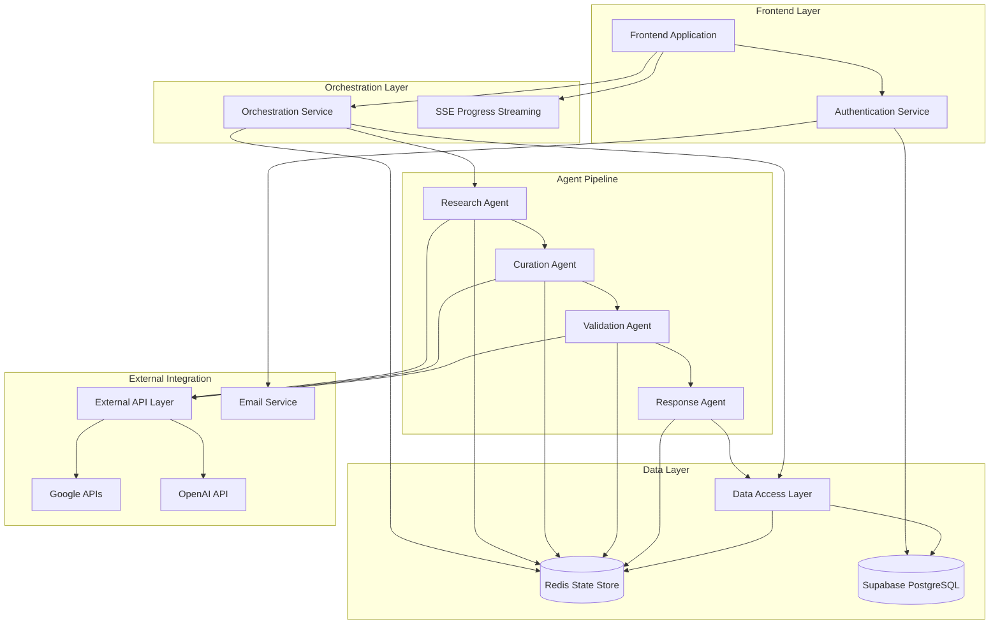

# Components

Based on the architectural patterns, tech stack, and data models defined above, the system is organized into logical components that separate concerns while enabling efficient communication. Each component has clear boundaries and interfaces optimized for the function chaining architecture.

## Frontend Application

**Responsibility:** User interface for itinerary generation, progress tracking, and result consumption with mobile-first responsive design

**Key Interfaces:**
- React components for persona selection and requirements input
- Real-time progress tracking via Server-Sent Events
- Itinerary display with interactive timeline and activity cards
- PDF export and social sharing functionality

**Dependencies:** Supabase Auth, REST API endpoints, SSE progress streams

**Technology Stack:** Next.js 14 (App Router), TypeScript, Tailwind CSS, Zustand state management, deployed via Netlify static hosting

## Authentication Service

**Responsibility:** Magic link authentication, JWT token management, and user session coordination with Supabase Auth integration

**Key Interfaces:**
- Magic link generation and email delivery
- Token validation and JWT creation
- Session management and renewal
- User preference storage and retrieval

**Dependencies:** Supabase Auth, email delivery service, Redis session storage

**Technology Stack:** Netlify Functions, Supabase Auth SDK, JWT libraries, email delivery integration

## Orchestration Service

**Responsibility:** Coordinates the multi-agent pipeline, manages processing state in Redis, and provides real-time progress updates via Server-Sent Events

**Key Interfaces:**
- Itinerary request intake and validation
- Agent chaining coordination (Research → Curation → Validation → Response)
- Real-time progress broadcasting via SSE
- Error handling and recovery across agent failures

**Dependencies:** Redis state store, all agent services, SSE connection management

**Technology Stack:** Netlify Functions, Redis (Upstash), Server-Sent Events, agent coordination logic

## Research Agent

**Responsibility:** Discovers unique destinations and activities based on user requirements and persona selection, leveraging web research and local knowledge APIs

**Key Interfaces:**
- User requirements processing and destination research
- Persona-specific activity discovery (photography spots, food scenes, architecture, family activities)
- Data enrichment with local context and cultural insights
- Research results formatting for curation agent consumption

**Dependencies:** OpenAI GPT-4 API, web search APIs, local knowledge databases

**Technology Stack:** Netlify Functions, OpenAI SDK, external research APIs, structured data processing

## Curation Agent

**Responsibility:** Creates personalized itineraries from research results, applying persona-specific curation logic and narrative storytelling for premium experience

**Key Interfaces:**
- Research result processing and activity selection
- Persona-driven curation (Photography Weekend, Food-Forward Explorer, Architecture Enthusiast, Family Adventure)
- Narrative generation with "why this matters" storytelling
- Timing optimization and neighborhood clustering

**Dependencies:** Research Agent output, OpenAI GPT-4 API, persona-specific prompts and logic

**Technology Stack:** Netlify Functions, OpenAI SDK, persona curation algorithms, timing optimization logic

## Validation Agent

**Responsibility:** Verifies all recommendations against external APIs to ensure accuracy, prevents hallucinations, and enriches activity data with real-world information

**Key Interfaces:**
- Activity verification against Google Places API
- Business hours, contact info, and rating validation
- Accessibility information and current status checking
- Quality scoring and confidence assessment

**Dependencies:** Google Places API, Google Maps API, Curation Agent output

**Technology Stack:** Netlify Functions, Google Places/Maps SDKs, validation scoring algorithms, data enrichment logic

## Response Agent

**Responsibility:** Formats validated itinerary data into beautiful, user-friendly presentations optimized for mobile consumption and sharing

**Key Interfaces:**
- Final itinerary formatting and presentation optimization
- Mobile-responsive layout generation
- Export preparation (PDF-ready formatting)
- Shareable content creation with social media optimization

**Dependencies:** Validation Agent output, formatting templates, export generation utilities

**Technology Stack:** Netlify Functions, PDF generation libraries, template processing, mobile-optimized formatting

## Data Access Layer

**Responsibility:** Abstracts database operations through Supabase client wrappers, enabling testing and future database flexibility while leveraging auto-generated APIs

**Key Interfaces:**
- User CRUD operations with preference management
- Itinerary storage with complex activity relationships
- Processing request tracking and audit trails
- Caching layer integration with Redis

**Dependencies:** Supabase PostgreSQL, Redis cache, database connection management

**Technology Stack:** Supabase JavaScript SDK, Redis client, TypeScript data access patterns, connection pooling

## External API Integration Layer

**Responsibility:** Manages all external API communications with proper rate limiting, caching, error handling, and cost optimization strategies

**Key Interfaces:**
- Google Places/Maps API integration with rate limiting
- OpenAI API calls with cost tracking and optimization
- Email delivery service integration
- External research API coordination

**Dependencies:** Google APIs, OpenAI API, email services, rate limiting infrastructure

**Technology Stack:** API client libraries, rate limiting utilities, caching strategies, error recovery mechanisms

## Component Diagrams

