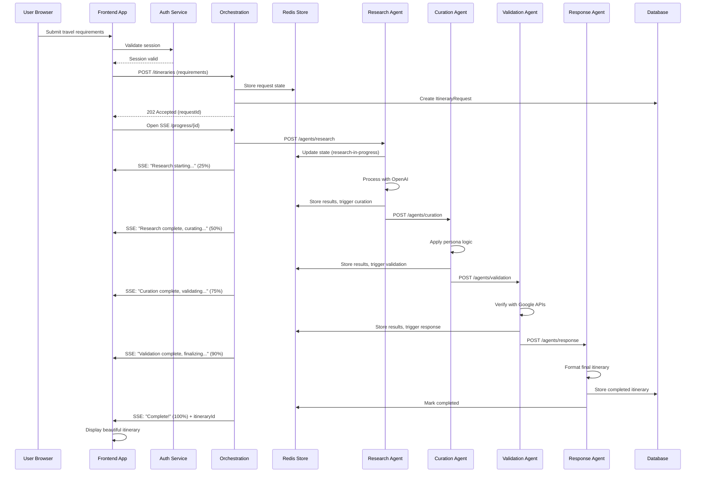

# Core Workflows

The following sequence diagrams illustrate key system workflows that demonstrate the function chaining architecture and component interactions:

```mermaid
sequenceDiagram
    participant User as User Browser
    participant FE as Frontend App
    participant Auth as Auth Service
    participant Orch as Orchestration
    participant Redis as Redis Store
    participant Research as Research Agent
    participant Curation as Curation Agent
    participant Validation as Validation Agent
    participant Response as Response Agent
    participant DB as Database

    User->>FE: Submit travel requirements
    FE->>Auth: Validate session
    Auth-->>FE: Session valid
    FE->>Orch: POST /itineraries (requirements)
    Orch->>Redis: Store request state
    Orch->>DB: Create ItineraryRequest
    Orch-->>FE: 202 Accepted (requestId)
    
    FE->>Orch: Open SSE /progress/{id}
    
    Orch->>Research: POST /agents/research
    Research->>Redis: Update state (research-in-progress)
    Orch->>FE: SSE: "Research starting..." (25%)
    
    Research->>Research: Process with OpenAI
    Research->>Redis: Store results, trigger curation
    Research->>Curation: POST /agents/curation
    Orch->>FE: SSE: "Research complete, curating..." (50%)
    
    Curation->>Curation: Apply persona logic
    Curation->>Redis: Store results, trigger validation
    Curation->>Validation: POST /agents/validation
    Orch->>FE: SSE: "Curation complete, validating..." (75%)
    
    Validation->>Validation: Verify with Google APIs
    Validation->>Redis: Store results, trigger response
    Validation->>Response: POST /agents/response
    Orch->>FE: SSE: "Validation complete, finalizing..." (90%)
    
    Response->>Response: Format final itinerary
    Response->>DB: Store completed itinerary
    Response->>Redis: Mark completed
    Orch->>FE: SSE: "Complete!" (100%) + itineraryId
    
    FE->>FE: Display beautiful itinerary
```
