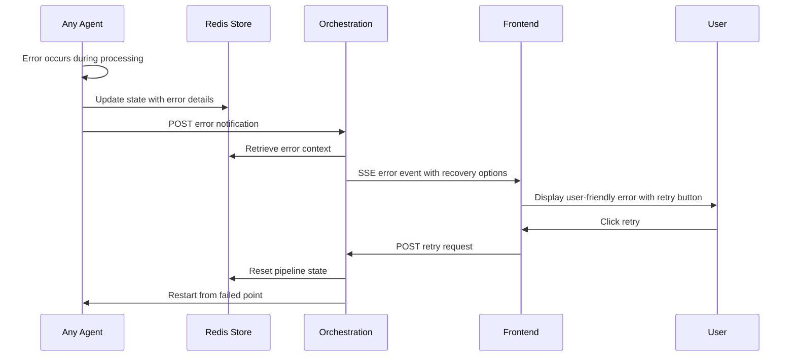

# Error Handling Strategy

## Error Flow



## Error Response Format

```typescript
interface ApiError {
  error: {
    code: string;           // 'AGENT_TIMEOUT', 'VALIDATION_FAILED', etc.
    message: string;        // User-friendly message
    details?: {             // Technical details for debugging
      agent?: string;
      stage?: string;
      originalError?: string;
    };
    timestamp: string;      // ISO timestamp
    requestId: string;      // For tracking and support
    retryable: boolean;     // Whether user can retry
  };
}
```

## Frontend Error Handling

```typescript
// Error boundary with agent-specific recovery
export function AgentErrorBoundary({ children }: { children: React.ReactNode }) {
  const [error, setError] = useState<ApiError | null>(null);
  const { retryItinerary } = useItineraryGeneration();

  const handleRetry = async () => {
    if (error?.error.retryable) {
      setError(null);
      await retryItinerary(error.error.requestId);
    }
  };

  if (error) {
    return (
      <ErrorDisplay 
        error={error} 
        onRetry={handleRetry}
        showTechnicalDetails={process.env.NODE_ENV === 'development'}
      />
    );
  }

  return <>{children}</>;
}
```

## Backend Error Handling

```typescript
// Standardized error handler for all Netlify Functions
export async function withErrorHandler<T>(
  handler: () => Promise<T>,
  context: { functionName: string; requestId: string }
): Promise<Response> {
  try {
    const result = await handler();
    return Response.json(result);
  } catch (error) {
    const apiError: ApiError = {
      error: {
        code: error.code || 'UNKNOWN_ERROR',
        message: error.userMessage || 'Something went wrong. Please try again.',
        details: {
          originalError: error.message,
          stack: process.env.NODE_ENV === 'development' ? error.stack : undefined
        },
        timestamp: new Date().toISOString(),
        requestId: context.requestId,
        retryable: error.retryable ?? true
      }
    };

    // Log to monitoring service
    console.error(`${context.functionName} error:`, apiError);
    
    return Response.json(apiError, { 
      status: error.statusCode || 500,
      headers: { 'Content-Type': 'application/json' }
    });
  }
}
```

---
