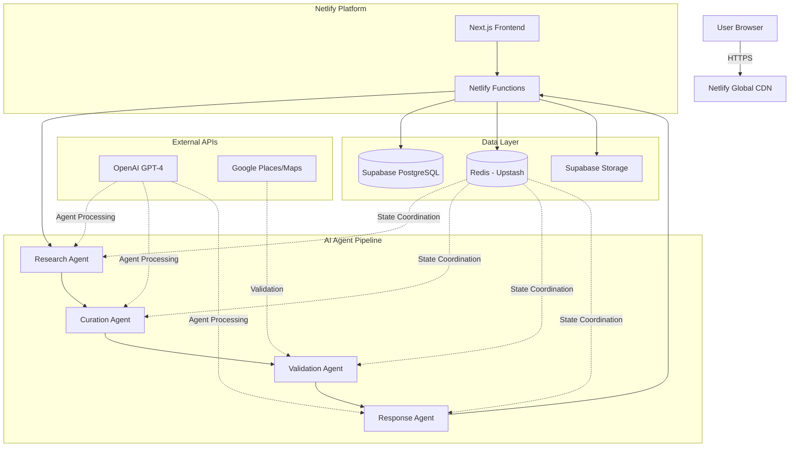

# High Level Architecture

## Technical Summary

Swift Travel employs a **serverless-first multi-agent orchestration architecture** deployed on **Netlify + Supabase**, leveraging **Next.js 14** for the frontend and **Netlify Functions** for the backend. The system orchestrates four specialized AI agents (Research, Curation, Validation, Response) through a **sequential pipeline architecture** with **Redis-based state coordination** to generate personalized weekend itineraries within the <20 second processing constraint. **Real-time external API integration** with Google Places and Maps provides validation and enrichment, while **shared TypeScript interfaces** ensure type safety across the entire stack. This architecture achieves the PRD's goals of premium travel curation while maintaining cost efficiency and horizontal scalability.

## Platform and Infrastructure Choice

**Platform:** Netlify + Supabase  
**Key Services:** Netlify Functions, Supabase Database + Auth + Storage, Redis (Upstash), Google Places/Maps APIs  
**Deployment Host and Regions:** Netlify Global CDN (primary: US-East, EU-West)

**Rationale:** This platform combination maintains development velocity and cost efficiency while working within the GitHub + Netlify deployment constraint:

- **Netlify**: Serverless functions for AI processing, built-in GitHub integration, automatic deployments, global CDN for frontend
- **Supabase**: Managed PostgreSQL with real-time capabilities, built-in auth reduces complexity, automatic API generation
- **Redis (Upstash)**: Serverless Redis for agent state coordination and caching without infrastructure management
- **GitHub Integration**: Seamless CI/CD through Netlify's GitHub integration with branch previews and atomic deployments

**Key Constraint:** Netlify Functions have a **10-second timeout limit** (vs Vercel's 15 seconds), requiring more aggressive optimization for the <20 second total processing requirement.

## Repository Structure

**Structure:** Monorepo with npm workspaces  
**Monorepo Tool:** npm workspaces (native Node.js solution)  
**Package Organization:** Feature-based separation with shared utilities

**Rationale:** Monorepo structure optimizes for the <20 second processing requirement by eliminating inter-service latency while enabling shared TypeScript interfaces between frontend and backend. npm workspaces provides sufficient tooling without additional complexity layers, crucial for rapid MVP development.

## High Level Architecture Diagram

## Architectural Patterns

- **Multi-Agent Orchestration:** Function chaining pattern with Redis state coordination - _Rationale:_ Each agent as separate Netlify Function eliminates 10-second timeout risk while maintaining sequential processing benefits and enabling independent agent optimization
- **Serverless Functions:** Stateless functions with external state management - _Rationale:_ Leverages Netlify's 10-second function limit through optimized processing while providing automatic scaling
- **API Gateway Pattern:** Centralized request handling through Netlify Functions - _Rationale:_ Single entry point enables consistent auth, rate limiting, and monitoring with GitHub integration
- **Repository Pattern:** Abstract data access through Supabase client wrappers - _Rationale:_ Enables testing and future database flexibility while leveraging Supabase's auto-generated APIs
- **Shared Type System:** TypeScript interfaces in shared package - _Rationale:_ Ensures type safety across full stack and prevents frontend/backend data mismatches
- **Validation-First Integration:** External API validation before user presentation - _Rationale:_ Meets <5% inaccuracy requirement by catching hallucinations before user exposure
